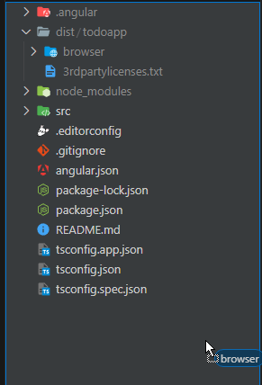
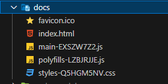
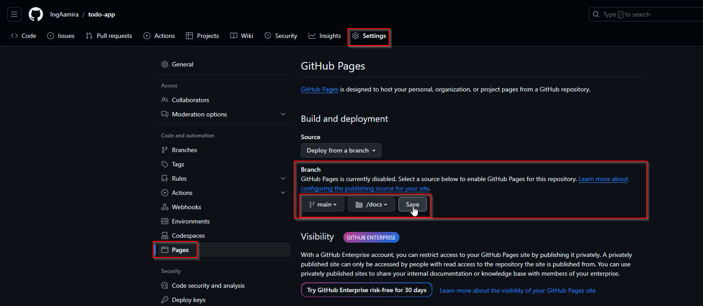
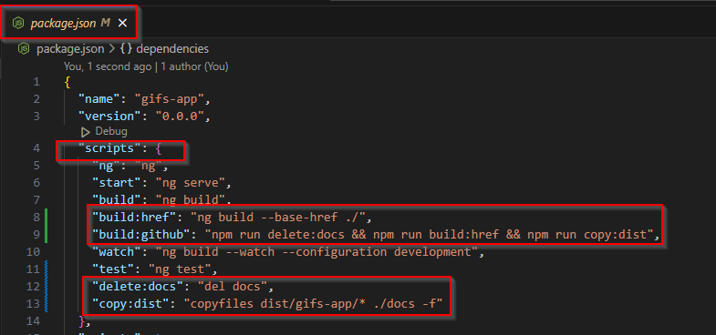

# Configurar Automática Github Page para Angular

**1.** Ejecutar `ng build` para generar los archivos de producción.

**2.** Mover la carpeta generada por el Build a la raiz del proyecto y renombrar por "docs".

- **Paso 1:**


- **Paso 2:**



- Paso 3: Renombrar carpeta por docs



**3.** Hacer commit en el remoto con los cambios generados.
- `git add .`
- `git commit -am "Add docs"`
- `git push origin main`

**4.** En el proyecto de [Github](https://github.com/) seguir la ruta: `Settings > Pages`



- **Seguir la ruta:**
  - `Build and deployment > Branch`

- Seleccionar las siguientes opciones:
  - **main**
  - **/docs**
  - **Save**

**5.** Instalar unas dependencias de desarrollo en la carpeta del proyecto:
    - Ejecutar `npm i del-cli --save-dev` -> Para eliminar archivos/directorios.
    - Luego, ejecutar `npm i copyfiles --save-dev` -> Para copiar archivos/directorios.

**6.** Modificar el archivo **package.json**, agregar las siguientes líneas en la opción de scripts

```json
  "scripts": {
    "build:href": "ng build --base-href ./",
    "build:github": "npm run delete:docs && npm run build:href && npm run copy:dist",
    "delete:docs": "del docs",
    "copy:dist": "copyfiles dist/gifs-app/* ./docs -f"
  }
```



**7.** Guardar cambios

**8.** Esta sería toda la consiguración ahora, ejecutar el comando `npm run build:github` para correr el proceso automático.


